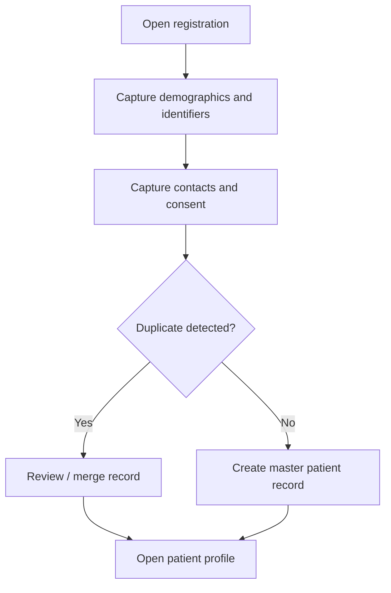

# Patient Registration and MPI

```mermaid
flowchart TD
    A[Open registration] --> B[Capture demographics and identifiers]
    B --> C[Capture contacts and consent]
    C --> D{Duplicate detected?}
    D -- Yes --> E[Review / merge record]
    D -- No --> F[Create master patient record]
    E --> G[Open patient profile]
    F --> G
```

Implemented in:
- `patients`
- `templates/patients/register.html`
- `templates/patients/profile.html`

