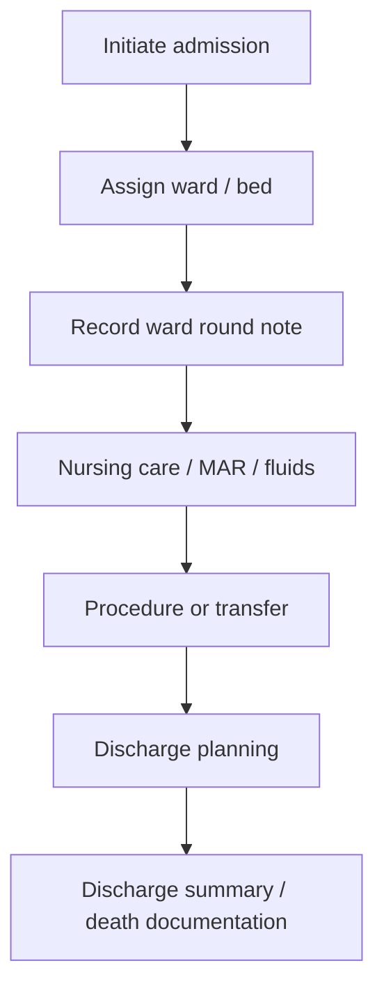

# Inpatient Admission and Ward Flow

 

Grand Gaze

```mermaid
flowchart TD
    A[Initiate admission] --> B[Assign ward / bed]
    B --> C[Record ward round note]
    C --> D[Nursing care / MAR / fluids]
    D --> E[Procedure or transfer]
    E --> F[Discharge planning]
    F --> G[Discharge summary / death documentation]
```

Implemented in:
- `inpatient`
- `inpatient/templates/inpatient/*`
