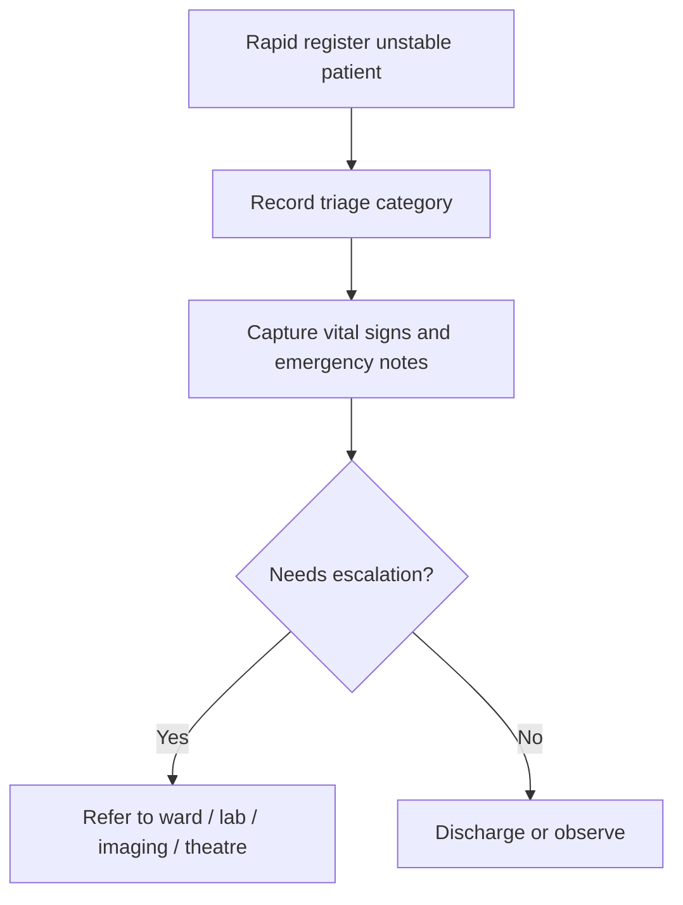

# Emergency and Triage Flow

```mermaid
flowchart TD
    A[Rapid register unstable patient] --> B[Record triage category]
    B --> C[Capture vital signs and emergency notes]
    C --> D{Needs escalation?}
    D -- Yes --> E[Refer to ward / lab / imaging / theatre]
    D -- No --> F[Discharge or observe]
```

Implemented in:
- `emergency`
- `emergency/templates/emergency/*`

