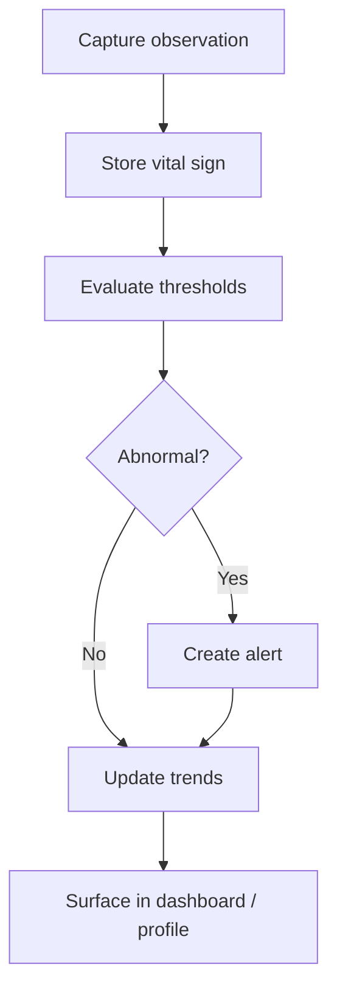

# Vital Signs and Abnormal Alerts

 

Grand Gaze

```mermaid
flowchart TD
    A[Capture observation] --> B[Store vital sign]
    B --> C[Evaluate thresholds]
    C --> D{Abnormal?}
    D -- Yes --> E[Create alert]
    D -- No --> F[Update trends]
    E --> F
    F --> G[Surface in dashboard / profile]
```

Implemented in:
- `vitals`
- `reporting`
- `templates/vitals/*`
- `templates/reporting/*`
