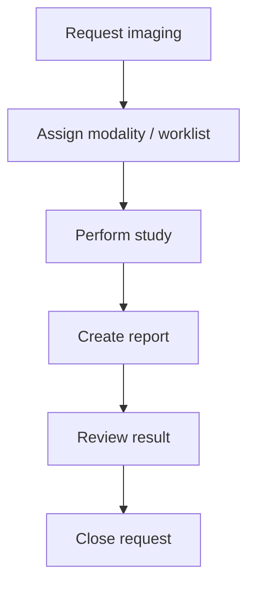

# Imaging Request and Report Flow

```mermaid
flowchart TD
    A[Request imaging] --> B[Assign modality / worklist]
    B --> C[Perform study]
    C --> D[Create report]
    D --> E[Review result]
    E --> F[Close request]
```

Implemented in:
- `imaging`
- `templates/imaging/*`

