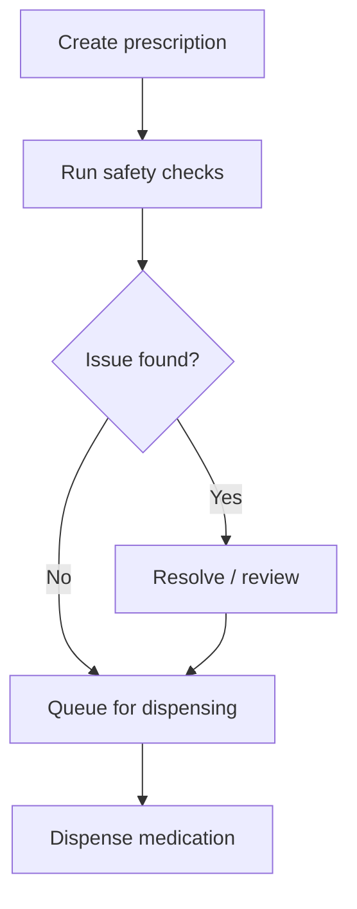

# Pharmacy Prescribing and Dispensing Flow

 

Grand Gaze

```mermaid
flowchart TD
    A[Create prescription] --> B[Run safety checks]
    B --> C{Issue found?}
    C -- Yes --> D[Resolve / review]
    C -- No --> E[Queue for dispensing]
    D --> E
    E --> F[Dispense medication]
```

Implemented in:
- `pharmacy`
- `templates/pharmacy/*`
