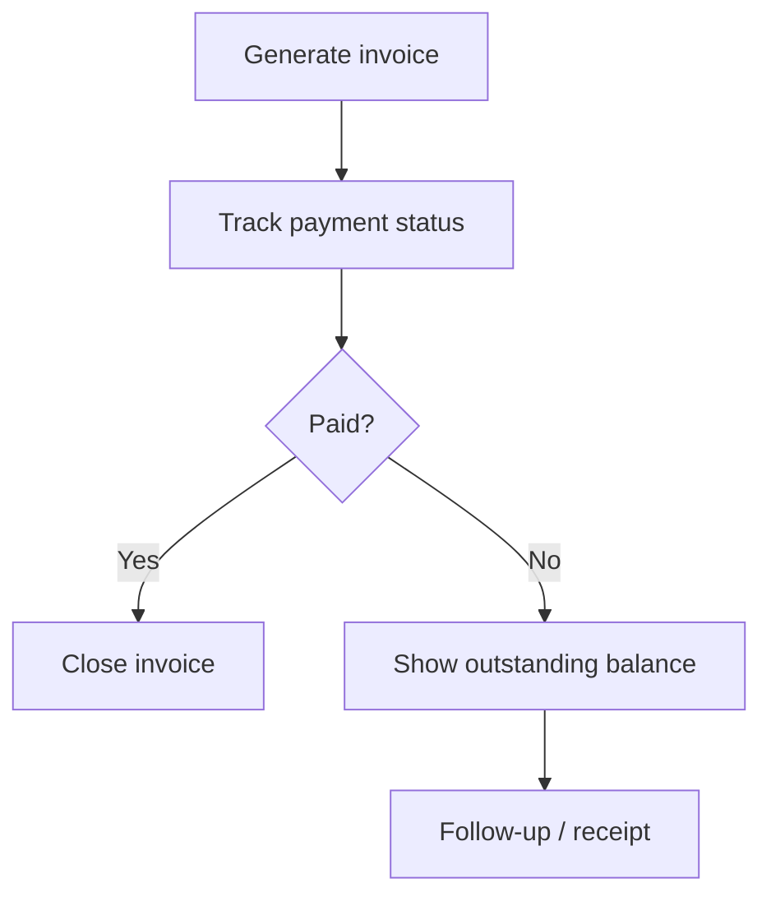

# Billing and Invoice Flow

```mermaid
flowchart TD
    A[Generate invoice] --> B[Track payment status]
    B --> C{Paid?}
    C -- Yes --> D[Close invoice]
    C -- No --> E[Show outstanding balance]
    E --> F[Follow-up / receipt]
```

Implemented in:
- `billing`
- `templates/billing/*`

