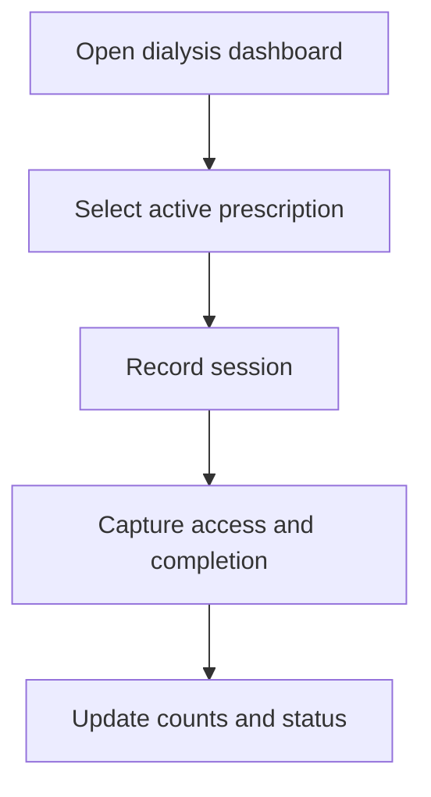

# Dialysis Session Recording Flow

  
  

```mermaid
flowchart TD
    A[Open dialysis dashboard] --> B[Select active prescription]
    B --> C[Record session]
    C --> D[Capture access and completion]
    D --> E[Update counts and status]
```

Implemented in:
- `dialysis`
- `dialysis/templates/dialysis/*`
