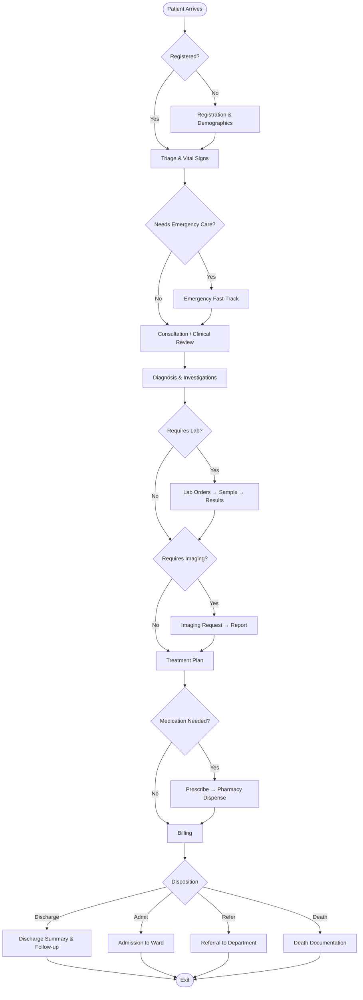

# Workflow 11.1 — Patient Journey

```mermaid
flowchart TD
    A([Patient Arrives]) --> B{Registered?}
    B -->|No| C[Registration & Demographics]
    B -->|Yes| D[Triage & Vital Signs]
    C --> D
    D --> E{Needs Emergency Care?}
    E -->|Yes| F[Emergency Fast-Track]
    E -->|No| G[Consultation / Clinical Review]
    F --> G
    G --> H[Diagnosis & Investigations]
    H --> I{Requires Lab?}
    I -->|Yes| J[Lab Orders → Sample → Results]
    I -->|No| K{Requires Imaging?}
    J --> K
    K -->|Yes| L[Imaging Request → Report]
    K -->|No| M[Treatment Plan]
    L --> M
    M --> N{Medication Needed?}
    N -->|Yes| O[Prescribe → Pharmacy Dispense]
    N -->|No| P[Billing]
    O --> P
    P --> Q{Disposition}
    Q -->|Discharge| R[Discharge Summary & Follow-up]
    Q -->|Admit| S[Admission to Ward]
    Q -->|Refer| T[Referral to Department]
    Q -->|Death| U[Death Documentation]
    R --> V([Exit])
    S --> V
    T --> V
    U --> V
```