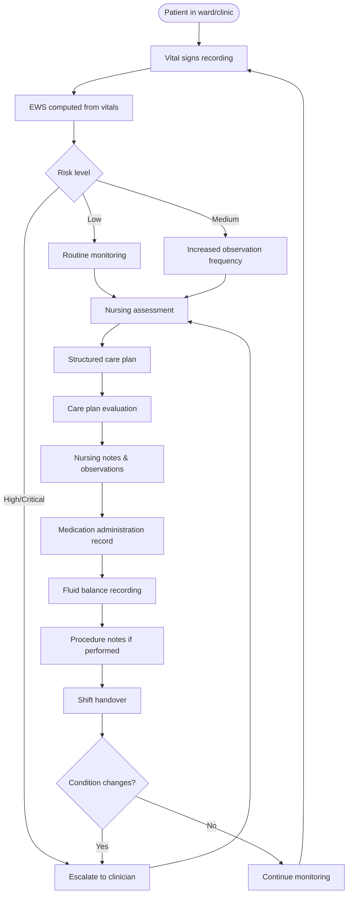

# Workflow 11.2 — Nursing Workflow

```mermaid
flowchart TD
    A([Patient in ward/clinic]) --> B[Vital signs recording]
    B --> C[EWS computed from vitals]
    C --> D{Risk level}
    D -->|Low| E[Routine monitoring]
    D -->|Medium| F[Increased observation frequency]
    D -->|High/Critical| G[Escalate to clinician]
    E --> H[Nursing assessment]
    F --> H
    G --> H
    H --> I[Structured care plan]
    I --> J[Care plan evaluation]
    J --> K[Nursing notes & observations]
    K --> L[Medication administration record]
    L --> M[Fluid balance recording]
    M --> N[Procedure notes if performed]
    N --> O[Shift handover]
    O --> P{Condition changes?}
    P -->|Yes| G
    P -->|No| Q[Continue monitoring]
    Q --> B
```
