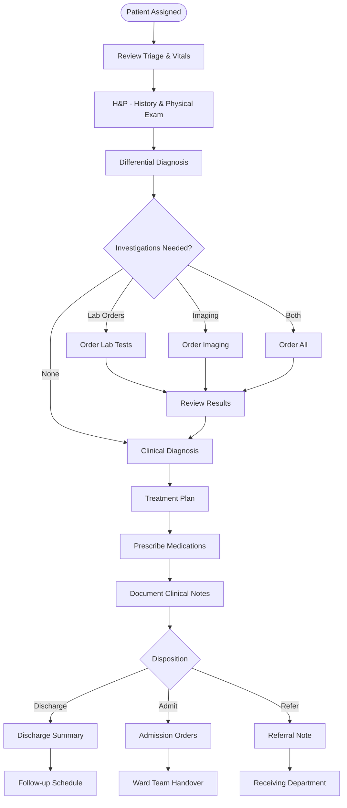

# Workflow 11.3 — Clinician Workflow

```mermaid
flowchart TD
    A([Patient Assigned]) --> B[Review Triage & Vitals]
    B --> C[H&P - History & Physical Exam]
    C --> D[Differential Diagnosis]
    D --> E{Investigations Needed?}
    E -->|Lab Orders| F[Order Lab Tests]
    E -->|Imaging| G[Order Imaging]
    E -->|Both| H[Order All]
    E -->|None| I[Clinical Diagnosis]
    F --> J[Review Results]
    G --> J
    H --> J
    J --> I
    I --> K[Treatment Plan]
    K --> L[Prescribe Medications]
    L --> M[Document Clinical Notes]
    M --> N{Disposition}
    N -->|Discharge| O[Discharge Summary]
    N -->|Admit| P[Admission Orders]
    N -->|Refer| Q[Referral Note]
    O --> R[Follow-up Schedule]
    P --> S[Ward Team Handover]
    Q --> T[Receiving Department]
```