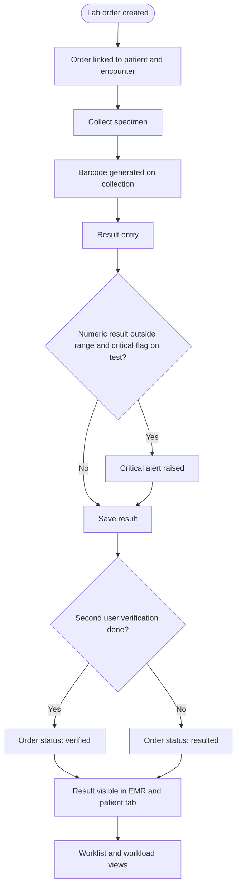

# Workflow 11.4 — Laboratory Workflow

```mermaid
flowchart TD
    A([Lab order created]) --> B[Order linked to patient and encounter]
    B --> C[Collect specimen]
    C --> D[Barcode generated on collection]
    D --> E[Result entry]
    E --> F{Numeric result outside range and critical flag on test?}
    F -->|Yes| G[Critical alert raised]
    F -->|No| H[Save result]
    G --> H
    H --> I{Second user verification done?}
    I -->|Yes| J[Order status: verified]
    I -->|No| K[Order status: resulted]
    J --> L[Result visible in EMR and patient tab]
    K --> L
    L --> M[Worklist and workload views]
```
