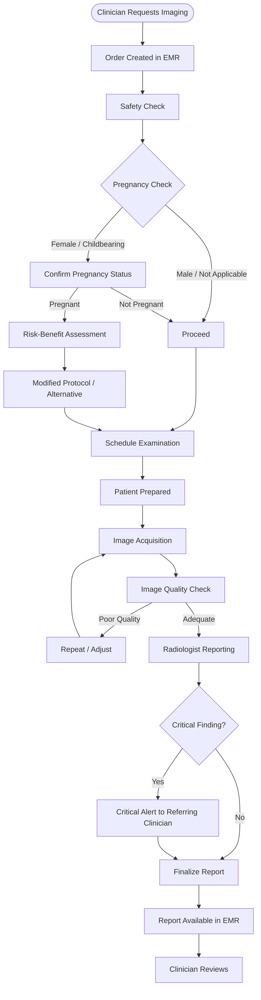

# Workflow 11.5 — Medical Imaging Workflow

```mermaid
flowchart TD
    A([Clinician Requests Imaging]) --> B[Order Created in EMR]
    B --> C[Safety Check]
    C --> D{Pregnancy Check}
    D -->|Female / Childbearing| E[Confirm Pregnancy Status]
    D -->|Male / Not Applicable| F[Proceed]
    E -->|Not Pregnant| F
    E -->|Pregnant| G[Risk-Benefit Assessment]
    G --> H[Modified Protocol / Alternative]
    F --> I[Schedule Examination]
    H --> I
    I --> J[Patient Prepared]
    J --> K[Image Acquisition]
    K --> L[Image Quality Check]
    L -->|Poor Quality| M[Repeat / Adjust]
    M --> K
    L -->|Adequate| N[Radiologist Reporting]
    N --> O{Critical Finding?}
    O -->|Yes| P[Critical Alert to Referring Clinician]
    O -->|No| Q[Finalize Report]
    P --> Q
    Q --> R[Report Available in EMR]
    R --> S[Clinician Reviews]
```