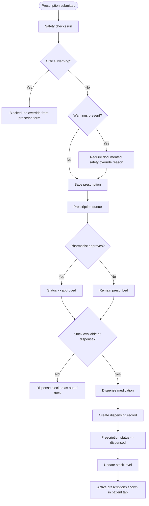

# Workflow 11.6 — Pharmacy Workflow

```mermaid
flowchart TD
    A([Prescription submitted]) --> B[Safety checks run]
    B --> C{Critical warning?}
    C -->|Yes| D[Blocked: no override from prescribe form]
    C -->|No| E{Warnings present?}
    E -->|Yes| F[Require documented safety override reason]
    E -->|No| G[Save prescription]
    F --> G
    G --> H[Prescription queue]
    H --> I{Pharmacist approves?}
    I -->|Yes| J[Status -> approved]
    I -->|No| K[Remain prescribed]
    J --> L{Stock available at dispense?}
    K --> L
    L -->|No| M[Dispense blocked as out of stock]
    L -->|Yes| N[Dispense medication]
    N --> O[Create dispensing record]
    O --> P[Prescription status -> dispensed]
    P --> Q[Update stock level]
    Q --> R[Active prescriptions shown in patient tab]
```
