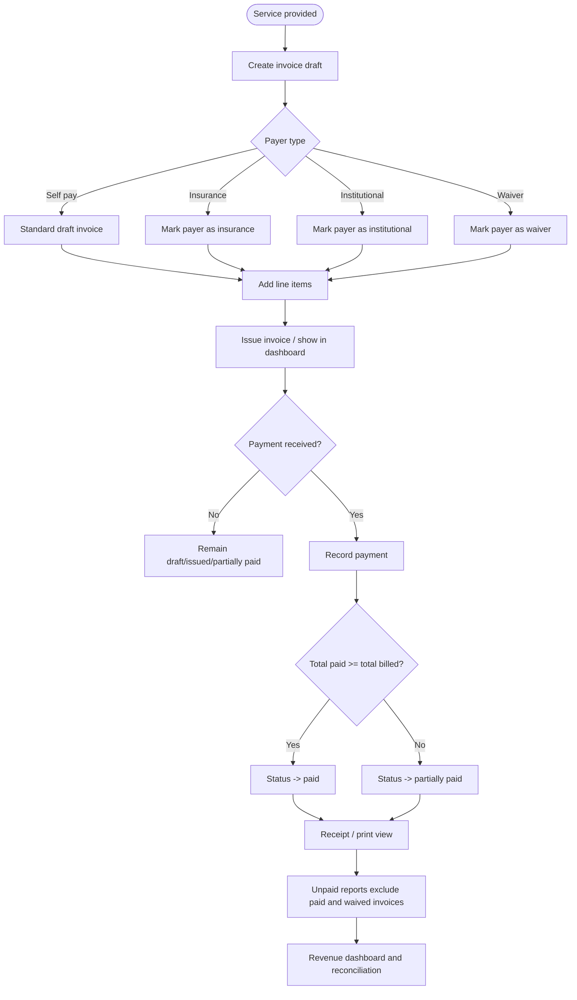

# Workflow 11.7 — Billing Workflow

```mermaid
flowchart TD
    A([Service provided]) --> B[Create invoice draft]
    B --> C{Payer type}
    C -->|Self pay| D[Standard draft invoice]
    C -->|Insurance| E[Mark payer as insurance]
    C -->|Institutional| F[Mark payer as institutional]
    C -->|Waiver| G[Mark payer as waiver]
    D --> H[Add line items]
    E --> H
    F --> H
    G --> H
    H --> I[Issue invoice / show in dashboard]
    I --> J{Payment received?}
    J -->|No| K[Remain draft/issued/partially paid]
    J -->|Yes| L[Record payment]
    L --> M{Total paid >= total billed?}
    M -->|Yes| N[Status -> paid]
    M -->|No| O[Status -> partially paid]
    N --> P[Receipt / print view]
    O --> P
    P --> Q[Unpaid reports exclude paid and waived invoices]
    Q --> R[Revenue dashboard and reconciliation]
```
